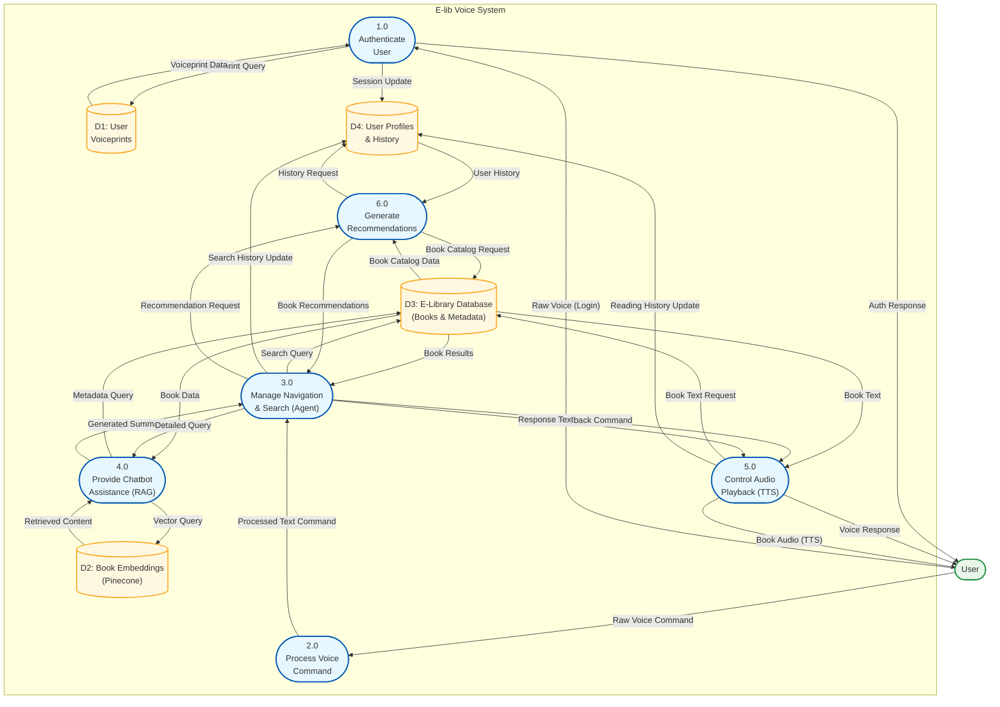

```mermaid
%% DFD Level 1 for E-lib Voice
%% Corrected Syntax: Using (["..."]) for Ovals

graph TD
    subgraph E-lib Voice System
        %% Processes (Ovals)
        P1(["1.0<br>Authenticate<br>User"])
        P2(["2.0<br>Process Voice<br>Command"])
        P3(["3.0<br>Manage Navigation<br>& Search (Agent)"])
        P4(["4.0<br>Provide Chatbot<br>Assistance (RAG)"])
        P5(["5.0<br>Control Audio<br>Playback (TTS)"])
        P6(["6.0<br>Generate<br>Recommendations"])

        %% Data Stores (Rectangles with open side)
        D1[("D1: User<br>Voiceprints")]
        D2[("D2: Book Embeddings<br>(Pinecone)")]
        D3[("D3: E-Library Database<br>(Books & Metadata)")]
        D4[("D4: User Profiles<br>& History")]

        %% Data Flows between Processes and Stores
        P1 -- "Voiceprint Query" --> D1
        D1 -- "Voiceprint Data" --> P1
        P1 -- "Session Update" --> D4

        P3 -- "Search Query" --> D3
        D3 -- "Book Results" --> P3
        P3 -- "Search History Update" --> D4

        P4 -- "Vector Query" --> D2
        D2 -- "Retrieved Content" --> P4
        P4 -- "Metadata Query" --> D3
        D3 -- "Book Data" --> P4
        P4 -- "Generated Summary" --> P3

        P5 -- "Book Text Request" --> D3
        D3 -- "Book Text" --> P5
        P5 -- "Reading History Update" --> D4

        P6 -- "History Request" --> D4
        D4 -- "User History" --> P6
        P6 -- "Book Catalog Request" --> D3
        D3 -- "Book Catalog Data" --> P6
        P6 -- "Book Recommendations" --> P3

        %% Data Flows between Processes
        P2 -- "Processed Text Command" --> P3
        P3 -- "Detailed Query" --> P4
        P3 -- "Playback Command" --> P5
        P3 -- "Recommendation Request" --> P6
        P3 -- "Response Text" --> P5
    end

    %% External Entity (Square)
    User([User])

    %% Data Flows to/from External Entity
    User -- "Raw Voice (Login)" --> P1
    P1 -- "Auth Response" --> User
    User -- "Raw Voice Command" --> P2
    P5 -- "Voice Response" --> User
    P5 -- "Book Audio (TTS)" --> User

    %% Styling
    classDef process fill:#E6F7FF,stroke:#0056B3,stroke-width:2px,rx:100,ry:100
    classDef entity fill:#E8F5E9,stroke:#1E8E3E,stroke-width:2px
    classDef datastore fill:#FFF8E1,stroke:#F9A825,stroke-width:2px,rx:10px,ry:10px
    class P1,P2,P3,P4,P5,P6 process
    class User entity
    class D1,D2,D3,D4 datastore
```
