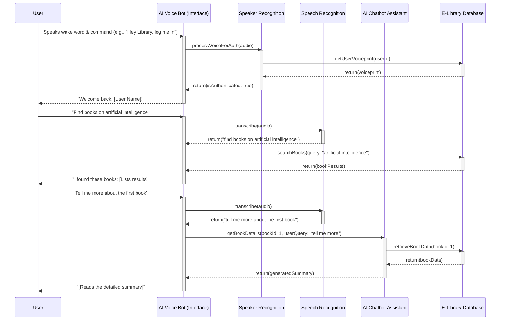

```mermaid
sequenceDiagram
    participant User
    participant AI Voice Bot (Interface)
    participant Speaker Recognition
    participant Speech Recognition
    participant AI Chatbot Assistant
    participant E-Library Database

    %% User Authentication %%
    User->>AI Voice Bot (Interface): Speaks wake word & command (e.g., "Hey Library, log me in")
    activate AI Voice Bot (Interface)
    AI Voice Bot (Interface)->>Speaker Recognition: processVoiceForAuth(audio)
    activate Speaker Recognition
    Speaker Recognition->>E-Library Database: getUserVoiceprint(userId)
    activate E-Library Database
    E-Library Database-->>Speaker Recognition: return(voiceprint)
    deactivate E-Library Database
    Speaker Recognition-->>AI Voice Bot (Interface): return(isAuthenticated: true)
    deactivate Speaker Recognition
    AI Voice Bot (Interface)-->>User: "Welcome back, [User Name]!"
    deactivate AI Voice Bot (Interface)

    %% Book Search %%
    User->>AI Voice Bot (Interface): "Find books on artificial intelligence"
    activate AI Voice Bot (Interface)
    AI Voice Bot (Interface)->>Speech Recognition: transcribe(audio)
    activate Speech Recognition
    Speech Recognition-->>AI Voice Bot (Interface): return("find books on artificial intelligence")
    deactivate Speech Recognition
    AI Voice Bot (Interface)->>E-Library Database: searchBooks(query: "artificial intelligence")
    activate E-Library Database
    E-Library Database-->>AI Voice Bot (Interface): return(bookResults)
    deactivate E-Library Database
    AI Voice Bot (Interface)-->>User: "I found these books: [Lists results]"
    deactivate AI Voice Bot (Interface)

    %% AI Chatbot Interaction %%
    User->>AI Voice Bot (Interface): "Tell me more about the first book"
    activate AI Voice Bot (Interface)
    AI Voice Bot (Interface)->>Speech Recognition: transcribe(audio)
    activate Speech Recognition
    Speech Recognition-->>AI Voice Bot (Interface): return("tell me more about the first book")
    deactivate Speech Recognition
    AI Voice Bot (Interface)->>AI Chatbot Assistant: getBookDetails(bookId: 1, userQuery: "tell me more")
    activate AI Chatbot Assistant
    AI Chatbot Assistant->>E-Library Database: retrieveBookData(bookId: 1)
    activate E-Library Database
    E-Library Database-->>AI Chatbot Assistant: return(bookData)
    deactivate E-Library Database
    AI Chatbot Assistant-->>AI Voice Bot (Interface): return(generatedSummary)
    deactivate AI Chatbot Assistant
    AI Voice Bot (Interface)-->>User: "[Reads the detailed summary]"
    deactivate AI Voice Bot (Interface)

```
