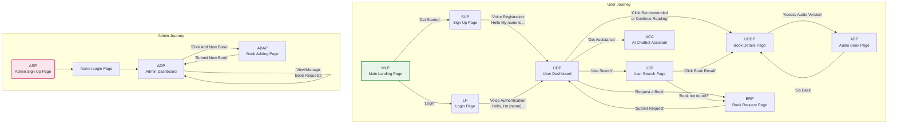

```mermaid
%% E-lib Voice Website Wireframe (Refactored for parser stability)
graph TD;

    %% User Journey Subgraph
    subgraph "User Journey";
        %% 1. Define all nodes in this subgraph first
        MLP[MLP<br>Main Landing Page];
        SUP(SUP<br>Sign Up Page);
        LP(LP<br>Login Page);
        UDP[UDP<br>User Dashboard];
        USP[USP<br>User Search Page];
        UBDP[UBDP<br>Book Details Page];
        BRP[BRP<br>Book Request Page];
        ACA[ACA<br>AI Chatbot Assistant];
        ABP[ABP<br>Audio Book Page];

        %% 2. Define all links for this subgraph
        MLP -->|'Get Started'| SUP;
        MLP -->|'Login'| LP;
        SUP -->|'Voice Registration:<br>Hello My name is...'| UDP;
        LP -->|"Voice Authentication:<br>Hello, I'm [name]..."| UDP;
        UDP -->|'Use Search'| USP;
        UDP -->|'Click Recommended<br>or Continue Reading'| UBDP;
        UDP -->|'Request a Book'| BRP;
        UDP -->|'Get Assistance'| ACA;
        USP -->|'Click Book Result'| UBDP;
        USP -->|'Book not found?'| BRP;
        UBDP -->|'Access Audio Version'| ABP;
        ABP -->|'Go Back'| UBDP;
        BRP -->|'Submit Request'| UDP;
    end;
    
    %% Admin Journey Subgraph
    subgraph "Admin Journey";
        %% 1. Define all nodes in this subgraph first
        ASP(ASP<br>Admin Sign Up Page);
        AdminLP[Admin Login Page];
        ADP[ADP<br>Admin Dashboard];
        ABAP[ABAP<br>Book Adding Page];

        %% 2. Define all links for this subgraph
        ASP --> AdminLP;
        AdminLP --> ADP;
        ADP -->|'Click Add New Book'| ABAP;
        ADP -- "View/Manage<br>Book Requests" --> ADP;
        ABAP -->|'Submit New Book'| ADP;
    end;
    
    %% Styling
    style MLP fill:#E8F5E9,stroke:#1E8E3E,stroke-width:2px;
    style ASP fill:#FCE4EC,stroke:#C2185B,stroke-width:2px;

```
